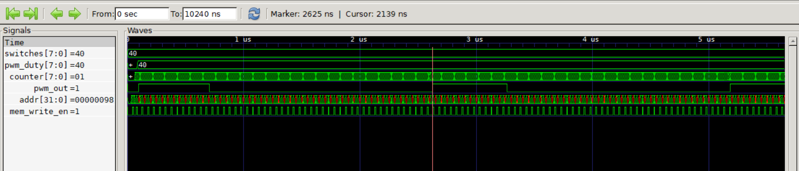
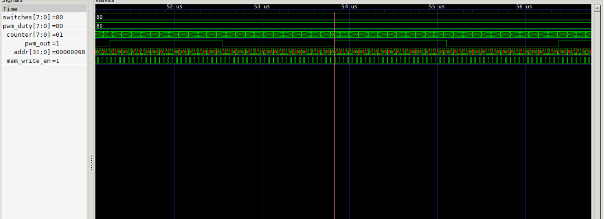
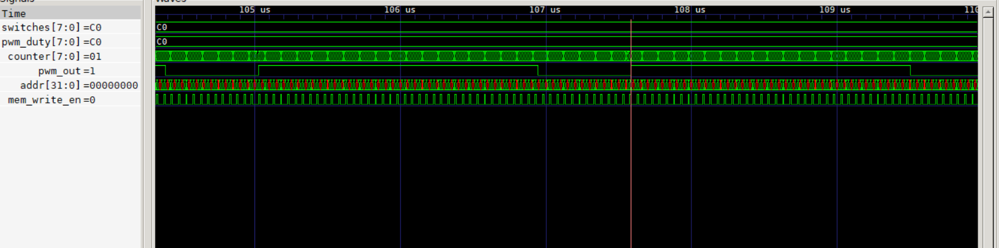
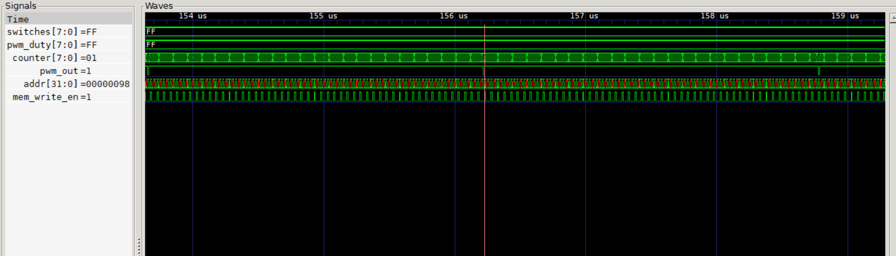
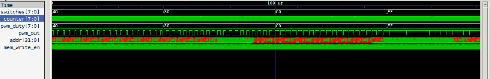
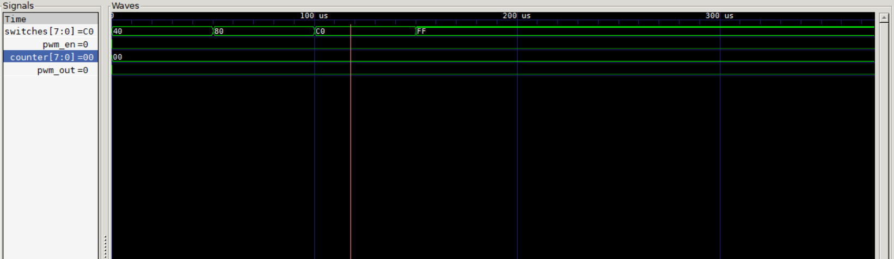
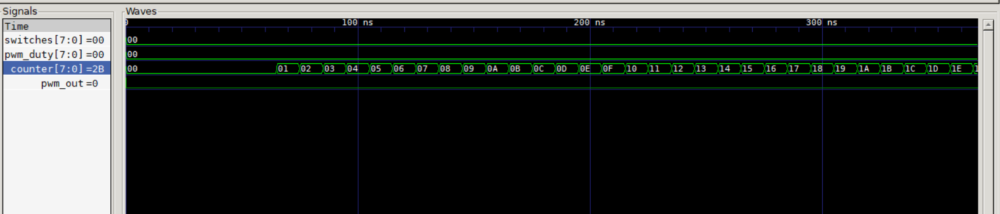
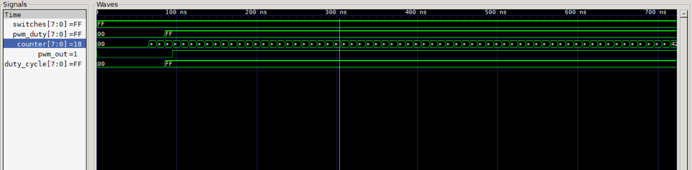
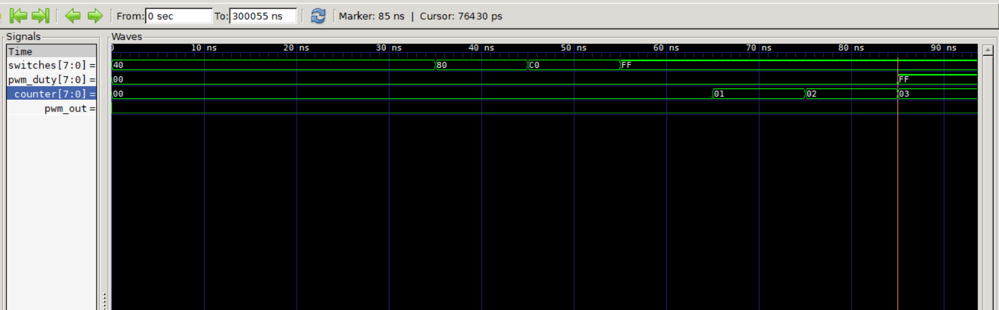

# Test Report – MIPS Pipelined Processor with MMIO PWM Control

## 1. Motor Profile Verification

### Implemented Profile

**Option B – Switch-Controlled PWM**

The processor continuously reads the switch value from the MMIO register at address `0x90` and writes the value to the PWM duty-cycle register at address `0x98`.

### Waveform Verification

**Figure 1. Switch-controlled PWM operation**







The waveform shows three different switch values:

| Switch Value | PWM Duty Value | Expected Duty Cycle |
| ------------ | -------------- | ------------------- |
| 0x40         | 0x40           | 25%                 |
| 0x80         | 0x80           | 50%                 |
| 0xC0         | 0xC0           | 75%                 |

The following waveform regions should be annotated:

* Region A: `switches = 0x40`, `pwm_duty = 0x40`
* Region B: `switches = 0x80`, `pwm_duty = 0x80`
* Region C: `switches = 0xC0`, `pwm_duty = 0xC0`

The duty cycle of `pwm_out` increases as the switch value increases.

### Assembly Explanation

The assembly program first enables the PWM peripheral by writing a value of 1 to the PWM enable register (`0x9C`). It then enters an infinite loop that repeatedly reads the switch value from MMIO address `0x90` and writes the result to the PWM duty-cycle register at address `0x98`. As the switch value changes, the PWM controller immediately receives a new duty-cycle value and updates the output waveform.

```assembly
addi $t0, $zero, 1
sw   $t0, 156($zero)

loop:
lw   $t1, 144($zero)
sw   $t1, 152($zero)
j    loop
```

---

## 2. Edge Cases Tested

### Test 1: PWM Disabled

**Figure 2. PWM disabled**



The PWM enable register was set to 0.

Expected behavior:

* `pwm_en = 0`
* `pwm_out = 0`

Observed behavior:

The PWM output remained low regardless of the duty-cycle value, confirming correct enable control.

---

### Test 2: Duty Cycle = 0

**Figure 3. Duty cycle set to 0**



Expected behavior:

* `pwm_duty = 0`
* `pwm_out` always low

Observed behavior:

The PWM output remained low during the entire counter period.

---

### Test 3: Duty Cycle = 255

**Figure 4. Duty cycle set to 255**



Expected behavior:

* `pwm_duty = 255`
* `pwm_out` high for almost the entire PWM period

Observed behavior:

The PWM output remained high except for the final counter comparison boundary, matching the expected behavior.

---

### Test 4: Fast Switch Changes

**Figure 5. Rapid switch updates**



The switch value was changed faster than the software loop could execute.

Expected behavior:

The processor samples only the values present when the MMIO read instruction executes.

Observed behavior:

Intermediate switch values are skipped, but the PWM duty-cycle register always converges to the latest switch value read by the processor. No incorrect or unstable PWM outputs were observed.

---

## Conclusion

The switch-controlled PWM profile operated correctly. The processor successfully read switch values through MMIO and updated the PWM duty-cycle register. Waveform analysis confirmed that the PWM output changed proportionally to the switch value and that all tested edge cases behaved as expected.
